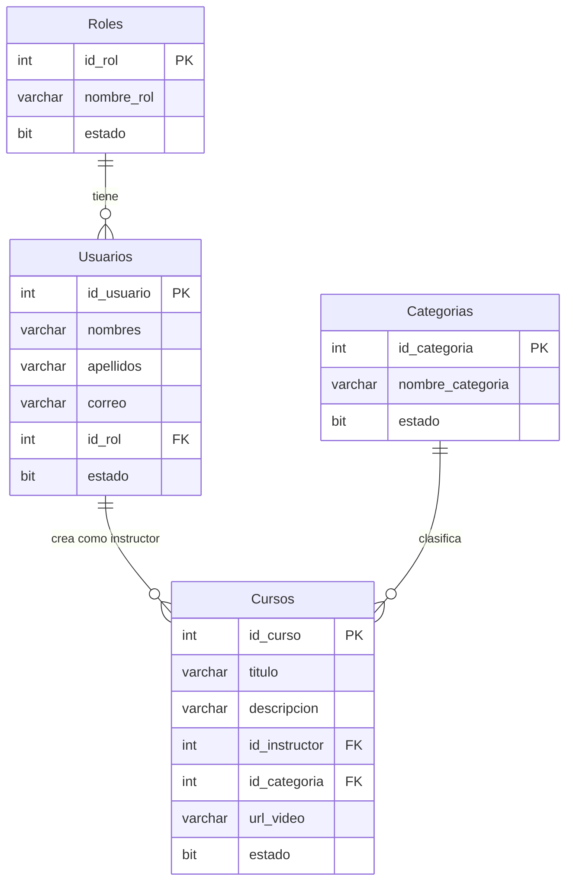
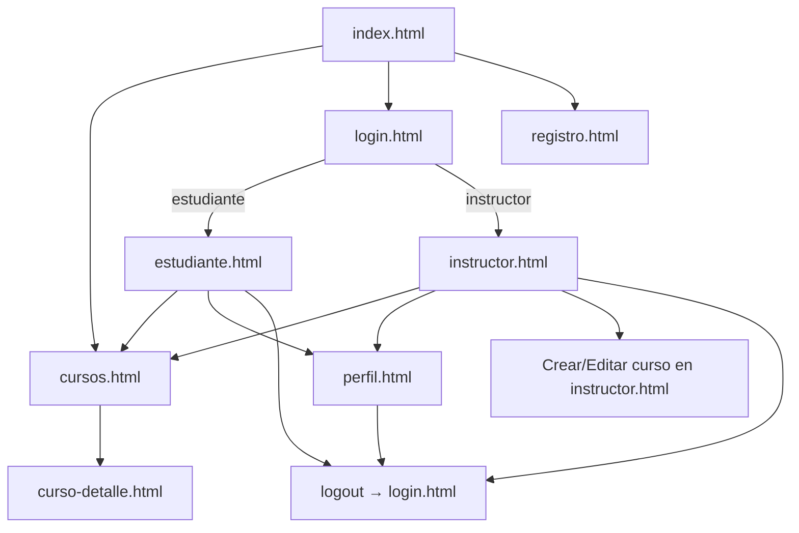

# Plan de implementación — Módulo 2: Cursos

Documento de diseño para el segundo módulo del **Sistema de Cursos Virtuales ITQ**.  
Basado en el estado actual del proyecto (Módulo 1 completado: usuarios, roles, login, perfil y sesión).

> **Alcance del Módulo 2:** gestión de cursos (catálogo, creación, edición y desactivación por instructores; visualización pública y por rol).  
> **Fuera de alcance inmediato:** inscripciones, lecciones, progreso y reportes (reservados para el Módulo 3).

---

## 1. Tablas nuevas necesarias para el Módulo 2

Se recomienda un script `SQL/02_crear_modulo_cursos.sql` que **no elimine** las tablas del Módulo 1.

### 1.1 `Categorias` (opcional pero recomendada)

Permite organizar el catálogo y facilita filtros en pantallas futuras.

| Campo | Tipo | Restricciones | Descripción |
|-------|------|---------------|-------------|
| `id_categoria` | INT | PK, IDENTITY | Identificador |
| `nombre_categoria` | VARCHAR(80) | NOT NULL, UNIQUE | Ej.: Programación, Bases de datos |
| `descripcion` | VARCHAR(255) | NULL | Texto breve |
| `estado` | BIT | DEFAULT 1 | Activa/inactiva |

**Datos semilla sugeridos:** Programación, Bases de datos, Desarrollo web.

---

### 1.2 `Cursos` (tabla principal del módulo)

| Campo | Tipo | Restricciones | Descripción |
|-------|------|---------------|-------------|
| `id_curso` | INT | PK, IDENTITY | Identificador |
| `titulo` | VARCHAR(120) | NOT NULL | Nombre del curso |
| `descripcion` | VARCHAR(500) | NOT NULL | Resumen visible en catálogo |
| `id_instructor` | INT | NOT NULL, FK → `Usuarios.id_usuario` | Instructor creador |
| `id_categoria` | INT | NULL, FK → `Categorias.id_categoria` | Clasificación |
| `url_video` | VARCHAR(255) | NULL | Ruta o URL del video introductorio |
| `imagen_portada` | VARCHAR(255) | NULL | Ruta de imagen de portada |
| `fecha_creacion` | DATETIME | DEFAULT GETDATE() | Alta del curso |
| `fecha_actualizacion` | DATETIME | NULL | Última modificación |
| `estado` | BIT | DEFAULT 1 | 1 = publicado, 0 = inactivo/borrado lógico |

**Índices sugeridos:**
- `IX_Cursos_id_instructor` sobre `id_instructor`
- `IX_Cursos_estado` sobre `estado`

**Regla de negocio en BD (opcional):** trigger o CHECK que valide que `id_instructor` pertenezca a un usuario con rol `instructor` y `estado = 1`. Si no se usa trigger, la validación debe hacerse en el backend.

---

### 1.3 Tablas que NO se crean en el Módulo 2 (reservadas para Módulo 3)

Se documentan aquí para que el diseño del Módulo 2 no las bloquee:

| Tabla futura | Propósito en Módulo 3 |
|--------------|----------------------|
| `Inscripciones` | Relación estudiante ↔ curso |
| `Lecciones` | Contenido modular por curso |
| `ProgresoLecciones` | Avance del estudiante |
| `Reportes` / vistas | Métricas e indicadores |

El Módulo 2 debe dejar `Cursos.id_curso` estable como clave foránea futura.

---

## 2. Relaciones con las tablas `Usuarios` y `Roles` existentes

```txt
Roles (1) ──< Usuarios (1) ──< Cursos (N)
                      │
                      └── id_instructor referencia id_usuario

Categorias (1) ──< Cursos (N)   [opcional, id_categoria nullable]
```

### Detalle de relaciones

| Relación | Tipo | Descripción |
|----------|------|-------------|
| `Usuarios.id_rol` → `Roles.id_rol` | N:1 (existente) | Define si el usuario es `estudiante` o `instructor` |
| `Cursos.id_instructor` → `Usuarios.id_usuario` | N:1 (nueva) | Cada curso pertenece a un instructor |
| `Cursos.id_categoria` → `Categorias.id_categoria` | N:1 (nueva, opcional) | Clasificación del curso |

### Reglas de integridad

1. Solo usuarios con `Roles.nombre_rol = 'instructor'` y `Usuarios.estado = 1` pueden ser `id_instructor`.
2. Un instructor puede tener **varios** cursos.
3. Un curso tiene **un solo** instructor responsable (modelo simple; co-instructores sería extensión futura).
4. Desactivar un usuario instructor (`Usuarios.estado = 0`) **no debe borrar** sus cursos; se recomienda ocultarlos del catálogo público si el instructor está inactivo.
5. Los estudiantes **no** crean filas en `Cursos`; solo consumen el catálogo (inscripción = Módulo 3).

### Diagrama ER simplificado



---

## 3. Endpoints necesarios

Convención actual del proyecto: rutas bajo `/api/`, respuestas JSON con `{ ok, mensaje, ... }`, sesión con `credentials: 'include'`.

### 3.1 Middleware nuevo (no es endpoint, pero es requisito)

| Middleware | Descripción |
|------------|-------------|
| `requiereSesion` | Ya existe en Módulo 1 |
| `requiereRol(rol)` | Nuevo: valida `req.session.usuario.rol` |

### 3.2 Endpoints de cursos

| Método | Ruta | Auth | Rol | Descripción |
|--------|------|------|-----|-------------|
| `GET` | `/api/cursos` | Opcional* | Todos | Lista cursos activos (`estado = 1`). Query: `?categoria=`, `?buscar=` |
| `GET` | `/api/cursos/:id` | Opcional* | Todos | Detalle de un curso activo |
| `GET` | `/api/mis-cursos` | Sí | `instructor` | Cursos del instructor en sesión (activos e inactivos) |
| `POST` | `/api/cursos` | Sí | `instructor` | Crear curso |
| `PUT` | `/api/cursos/:id` | Sí | `instructor` | Editar curso propio |
| `PATCH` | `/api/cursos/:id/estado` | Sí | `instructor` | Activar/desactivar curso propio (borrado lógico) |

\* *Opcional:* el catálogo puede ser público; si se prefiere consistencia, exigir sesión también para listar.

### 3.3 Endpoints de categorías (si se implementa la tabla)

| Método | Ruta | Auth | Rol | Descripción |
|--------|------|------|-----|-------------|
| `GET` | `/api/categorias` | No | Todos | Lista categorías activas (para filtros y formularios) |

### 3.4 Endpoints del Módulo 1 que deben ajustarse

| Método | Ruta | Cambio propuesto |
|--------|------|------------------|
| `POST` | `/api/login` | Incluir en respuesta un campo `redirect` según rol (`estudiante.html` / `instructor.html` / `perfil.html`) |
| `GET` | `/api/perfil` | Sin cambios estructurales; puede usarse para validar sesión en paneles |

### 3.5 Endpoints que NO van en el Módulo 2

| Ruta futura | Módulo |
|-------------|--------|
| `POST /api/inscripciones` | Módulo 3 |
| `GET /api/mis-inscripciones` | Módulo 3 |
| `GET/POST /api/cursos/:id/lecciones` | Módulo 3 |
| `GET /api/reportes/...` | Módulo 4 o posterior |

### 3.6 Contratos JSON sugeridos

**POST `/api/cursos` — body:**
```json
{
  "titulo": "Curso de Programación Java",
  "descripcion": "Aprende POO y desarrollo en Java.",
  "id_categoria": 1,
  "url_video": "videos/curso1.mp4",
  "imagen_portada": "img/java.jpg"
}
```

**Respuesta exitosa típica:**
```json
{
  "ok": true,
  "mensaje": "Curso creado correctamente.",
  "curso": { "id_curso": 1, "titulo": "...", "...": "..." }
}
```

**Códigos HTTP a mantener (consistentes con Módulo 1):**
- `400` — validación
- `401` — sin sesión
- `403` — rol incorrecto o curso de otro instructor
- `404` — curso no encontrado
- `409` — conflicto (ej. título duplicado por mismo instructor, si se define esa regla)
- `500` — error de servidor

---

## 4. Pantallas necesarias

### 4.1 Pantallas a crear o reemplazar

| Archivo | Estado actual | Acción en Módulo 2 |
|---------|---------------|-------------------|
| `public/cursos.html` | Maqueta estática (3 cursos hardcodeados) | Reescribir: catálogo dinámico desde API |
| `public/instructor.html` | Placeholder | Panel completo: listar, crear, editar, desactivar cursos |
| `public/estudiante.html` | Placeholder | Panel básico: ver catálogo y mensaje “inscripción próximamente” (Módulo 3) |
| `public/curso-detalle.html` | No existe | Nueva: detalle de un curso (video, descripción, instructor) |

### 4.2 Pantallas existentes con cambios menores

| Archivo | Cambio |
|---------|--------|
| `public/index.html` | Enlaces coherentes; textos que ya no digan “módulo posterior” para cursos |
| `public/login.html` | Redirección post-login según rol |
| `public/perfil.html` | Enlace al panel según rol (estudiante/instructor) |
| `public/registro.html` | Sin cambios funcionales obligatorios |

### 4.3 Contenido funcional por pantalla

#### `cursos.html` — Catálogo público
- Grid de tarjetas cargadas desde `GET /api/cursos`
- Filtro por categoría (opcional)
- Búsqueda por título (opcional)
- Clic en tarjeta → `curso-detalle.html?id=X`
- Si no hay sesión: solo visualización
- Si hay sesión de estudiante: botón “Inscribirse” deshabilitado o mensaje “Disponible en Módulo 3”

#### `curso-detalle.html` — Detalle
- Título, descripción, categoría, instructor (nombre), video, imagen
- Botón volver al catálogo
- Acciones según rol (instructor dueño: editar; otros: solo ver)

#### `instructor.html` — Panel instructor
- Requiere sesión + rol `instructor`
- Tabla/lista de “Mis cursos” (`GET /api/mis-cursos`)
- Formulario crear curso (`POST /api/cursos`)
- Formulario editar curso (`PUT /api/cursos/:id`)
- Botón desactivar (`PATCH /api/cursos/:id/estado`)
- Enlace a catálogo público

#### `estudiante.html` — Panel estudiante
- Requiere sesión + rol `estudiante`
- Resumen de bienvenida
- Listado de cursos disponibles (misma fuente que catálogo)
- Sección placeholder: “Mis cursos inscritos — próximamente”
- Enlace a perfil y catálogo

### 4.4 Assets estáticos

| Recurso | Ubicación sugerida | Notas |
|---------|-------------------|-------|
| Videos | `public/videos/` | Referenciados en `url_video` |
| Portadas | `public/img/cursos/` | Referenciados en `imagen_portada` |
| Categorías | Solo en BD | No requiere carpeta extra |

---

## 5. Flujo de navegación

### 5.1 Visitante no autenticado

```txt
index.html
  ├── cursos.html (catálogo)
  │     └── curso-detalle.html?id=N
  ├── registro.html → (éxito) estudiante.html o mensaje instructor
  └── login.html → (éxito) redirección por rol
```

### 5.2 Estudiante autenticado

```txt
login.html
  └── estudiante.html (panel)
        ├── cursos.html
        │     └── curso-detalle.html?id=N
        ├── perfil.html
        └── logout → login.html
```

### 5.3 Instructor autenticado

```txt
login.html
  └── instructor.html (panel)
        ├── crear / editar curso (mismo panel o modal)
        ├── cursos.html (vista catálogo)
        │     └── curso-detalle.html?id=N
        ├── perfil.html
        └── logout → login.html
```

### 5.4 Reglas de redirección post-login

| Rol en sesión | Destino principal |
|---------------|-------------------|
| `estudiante` | `estudiante.html` |
| `instructor` | `instructor.html` |
| Sin rol / error | `login.html` |

`perfil.html` permanece accesible desde el menú para ambos roles.

### 5.5 Protección de rutas en frontend

Patrón ya usado en Módulo 1 (`cargarPerfil` redirige a login si falla `/api/perfil`):

- `instructor.html` y `estudiante.html` deben llamar a `/api/perfil` al cargar.
- Si `401` → `login.html`.
- Si rol incorrecto → redirigir al panel del rol correspondiente o mostrar error.

### 5.6 Diagrama de flujo general



---

## 6. Archivos que habrá que modificar

### 6.1 Archivos nuevos

| Archivo | Propósito |
|---------|-----------|
| `SQL/02_crear_modulo_cursos.sql` | Tablas `Categorias` y `Cursos`, datos semilla |
| `public/curso-detalle.html` | Vista de detalle de curso |
| `MODULO2_PLAN.md` | Este documento (referencia del equipo) |

### 6.2 Archivos a modificar

| Archivo | Cambios previstos |
|---------|-------------------|
| `server.js` | Middleware `requiereRol`, endpoints de cursos/categorías, validaciones, consultas SQL |
| `public/app.js` | Funciones API de cursos, lógica por pantalla, redirección post-login, protección de paneles |
| `public/cursos.html` | Catálogo dinámico (eliminar HTML hardcodeado) |
| `public/instructor.html` | Panel CRUD completo |
| `public/estudiante.html` | Panel con catálogo y placeholder de inscripciones |
| `public/login.html` | Ajuste de redirección (si se centraliza en `app.js`, cambio mínimo) |
| `public/index.html` | Textos y navegación actualizados |
| `public/perfil.html` | Enlaces al panel según rol |
| `public/styles.css` | Estilos para formularios CRUD, detalle, estados vacíos/error |
| `README.md` | Documentar Módulo 2, nuevo script SQL, nuevos endpoints |
| `.env.example` | Solo si se agregan variables (ej. ruta base de uploads); opcional en Módulo 2 |

### 6.3 Archivos que probablemente NO cambien

| Archivo | Motivo |
|---------|--------|
| `SQL/01_crear_base_modulo1.sql` | Módulo 1 estable; no recrear tablas existentes |
| `public/registro.html` | Registro ya funcional |
| `package.json` | Sin nuevas dependencias obligatorias (multer solo si se suben archivos) |
| `GUIA_GIT_GITHUB.md` | Sin cambios funcionales |

### 6.4 Orden de implementación sugerido

1. Script SQL `02_crear_modulo_cursos.sql` y ejecución en SSMS  
2. Middleware `requiereRol` + endpoints en `server.js`  
3. Pruebas con Postman o `/api/test-db` extendido  
4. `app.js` — funciones compartidas de cursos  
5. `cursos.html` + `curso-detalle.html`  
6. `instructor.html` (CRUD)  
7. `estudiante.html` + redirección post-login  
8. Ajustes de navegación en `index`, `perfil`, `README`

---

## 7. Riesgos de integración con el Módulo 1

| # | Riesgo | Impacto | Mitigación |
|---|--------|---------|------------|
| 1 | **Sin middleware de rol** — Módulo 1 solo tiene `requiereSesion` | Cualquier usuario autenticado podría crear cursos | Implementar `requiereRol('instructor')` antes de exponer POST/PUT |
| 2 | **Login siempre redirige a `perfil.html`** | Instructores y estudiantes no llegan a sus paneles | Cambiar redirección en `app.js` usando `usuario.rol` de la respuesta de login |
| 3 | **Sesión almacena rol como string** — si cambia en BD no se actualiza en sesión | Usuario con rol desactualizado en sesión | Tras editar perfil no cambia rol hoy; documentar que rol no es editable en perfil. Invalidar sesión si se cambia rol en BD (admin futuro) |
| 4 | **Script Módulo 1 hace DROP de tablas** | Ejecutar `01_...sql` de nuevo borra usuarios | Nunca re-ejecutar script 01 en producción; solo usar script 02 incremental |
| 5 | **`getPool()` sin pool singleton explícito** | Múltiples conexiones bajo carga | Aceptable en desarrollo; documentar mejora futura (reutilizar pool global) |
| 6 | **Validación de instructor solo en backend** | Datos inconsistentes si falla validación | Validar `id_instructor` contra JOIN Usuarios/Roles en POST y en UPDATE |
| 7 | **URLs de video/imagen como texto libre** | Rutas rotas, XSS si se renderiza HTML crudo | Sanitizar salida en frontend; validar prefijos (`videos/`, `img/`) en backend |
| 8 | **Catálogo estático actual en Git** | Confusión entre demo y datos reales | Eliminar contenido hardcodeado de `cursos.html` al integrar API |
| 9 | **CORS + cookies** — patrón actual funciona en localhost | Fallos si se despliega en otro dominio | Mantener `credentials: 'include'` y `cors({ origin: true, credentials: true })` |
| 10 | **Registro estudiante redirige a `estudiante.html` sin login** | Panel estudiante sin sesión activa | Tras registro, redirigir a `login.html` con mensaje, o auto-login (decisión de equipo) |

---

## 8. Qué debe quedar preparado para que el Módulo 3 continúe

El Módulo 3 (según README del proyecto) cubrirá **inscripciones, lecciones, progreso y reportes**. El Módulo 2 debe dejar estos cimientos:

### 8.1 Base de datos

- [ ] Tabla `Cursos` con `id_curso` estable y PK identity.
- [ ] Borrado lógico (`estado`) en cursos — no DELETE físico por defecto.
- [ ] FK `Cursos.id_instructor` → `Usuarios.id_usuario` nombrada explícitamente (ej. `FK_Cursos_Usuarios`).
- [ ] Espacio en diseño para tablas futuras sin renombrar campos:

```txt
Inscripciones (Módulo 3)
  id_inscripcion, id_estudiante → Usuarios, id_curso → Cursos,
  fecha_inscripcion, estado

Lecciones (Módulo 3)
  id_leccion, id_curso → Cursos, titulo, orden, url_contenido, duracion

ProgresoLecciones (Módulo 3)
  id_progreso, id_inscripcion, id_leccion, completada, fecha
```

### 8.2 API

- [ ] Endpoints de cursos devuelven `id_curso` en todas las listas (clave para inscripciones).
- [ ] Separar claramente rutas públicas (`GET /api/cursos`) de rutas de gestión (`POST`, `PUT`, `PATCH`).
- [ ] Respuestas de error consistentes (`ok`, `mensaje`) para reutilizar en Módulo 3.
- [ ] Middleware `requiereRol` reutilizable para `estudiante` en inscripciones.

### 8.3 Frontend

- [ ] `curso-detalle.html` con parámetro `?id=` — punto de anclaje para botón “Inscribirse” en Módulo 3.
- [ ] `estudiante.html` con sección reservada “Mis cursos inscritos”.
- [ ] `instructor.html` con contador o listado preparado para enlace “Ver lecciones” (deshabilitado hasta Módulo 3).
- [ ] Función `consumirAPI` en `app.js` ya usada por cursos — no duplicar fetch.

### 8.4 Convenciones a mantener

| Aspecto | Convención actual | Mantener en Módulo 2 |
|---------|-------------------|----------------------|
| Nombres de tablas | PascalCase plural (`Usuarios`, `Roles`) | `Cursos`, `Categorias` |
| Nombres de columnas | snake_case con prefijo (`id_usuario`, `nombre_rol`) | `id_curso`, `id_instructor` |
| API | Prefijo `/api/`, JSON, español en mensajes | Igual |
| Auth | Sesión Express + cookie | Igual |
| SQL | Consultas parametrizadas con `.input()` | Igual |

### 8.5 Definition of Done — Módulo 2

El Módulo 2 se considera terminado cuando:

1. Un instructor autenticado puede crear, editar y desactivar cursos persistidos en SQL Server.
2. El catálogo en `cursos.html` muestra datos reales desde la API.
3. Un estudiante autenticado ve el catálogo desde su panel pero **no** inscribe (botón reservado).
4. Las tablas y endpoints están documentados en `README.md`.
5. No se rompe registro, login, perfil ni logout del Módulo 1.

---

## Referencias internas

| Recurso | Ubicación |
|---------|-----------|
| Script BD Módulo 1 | `SQL/01_crear_base_modulo1.sql` |
| API y conexión | `server.js` |
| Frontend compartido | `public/app.js` |
| Catálogo actual (mock) | `public/cursos.html` |
| Documentación general | `README.md` |

---

*Documento generado como plan de trabajo. No incluye implementación de código.*
